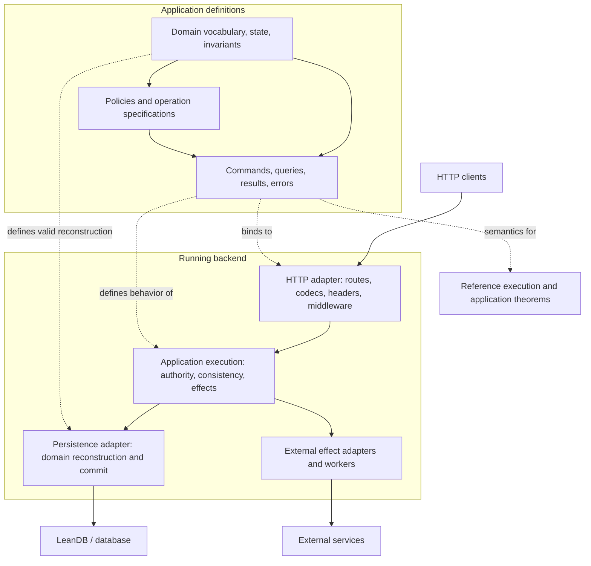

# LeanAPI: domain-driven backend design

Status: exploratory design, 2026-09-22. Based on [intent.md](intent.md).

This document sketches a backend built around application meaning: the values a domain admits, the actions it permits, the facts it preserves, and the information each caller may observe. HTTP and persistence make that domain usable as a running service.

The architecture is a proposal. Code blocks describe semantic shapes, not implemented APIs or compiling examples. Named proof obligations are goals, not completed proofs. Questions in §12 remain open; neither the diagrams nor the proposed implementation sequence settles them.

## 1. Intent and requirements

LeanAPI should provide the ordinary facilities expected of an Express/FastAPI-style backend: routing, endpoint definitions, request and response headers, authentication, validation, and middleware. The stated authentication requirements include JWT, bearer tokens, and username/password flows. The first middleware interface can follow familiar framework conventions.

Its central purpose is to preserve domain semantics across the API, application, and database boundaries, including integration with LeanDB. Applications should be able to state and prove their own properties. Two motivating properties are user isolation and endpoint idempotence.

An ideal developer experience is:

1. Define what the application means in Lean.
2. Define the operations that make sense in that domain.
3. Choose how those operations are exposed and persisted.
4. State the properties that matter for this application.
5. See which properties follow from types, which need proofs, which are checked at runtime, and which depend on trusted execution.

This design is independent of a particular frontend or existing application framework. Existing libraries can supply implementations once the required interfaces are understood.

The long-term framework ambition is broad. The exact v0.1 feature matrix and required proof coverage remain open (Q12).

## 2. Begin with the domain

### 2.1 Vocabulary, values, and identity

A domain names its concepts: `Game`, `Player`, `Move`, `Seat`, `TimeControl`, `Order`, or `Money`. These names should carry meaning beyond their serialized shape.

- Value types express local constraints, such as a nonempty title or a positive quantity.
- Sum types describe meaningful alternatives, such as an order being a draft, placed, or cancelled.
- Entity identities distinguish a particular game from a particular player. Possessing a well-formed ID grants no authority over the entity.
- Relationships express domain facts. A user reference might identify a creator, opponent, reviewer, or recipient; it does not automatically mean ownership.
- Some facts are derived. Whether a chess position is stored or reconstructed from a log is a persistence choice; the domain defines what the position means.

Different domains may use different meanings for the same word. A billing customer and a game player need not share one global entity or schema. Where bounded contexts interact, their translation and obligations should be explicit. This does not require separate services or processes.

### 2.2 Invariants have different scopes

A rule belongs where its evidence is available.

| Rule | Evidence needed | Likely enforcement points |
|---|---|---|
| A title is nonempty | The value itself | Domain constructor; wire and storage decoding |
| A move is legal | Current game state and proposed move | Domain decision; admission against the commit state |
| A username is unique | Other stored users | Application contract; atomic storage constraint |
| Only a participant can read a private game | Authenticated actor and current participation policy | Authorized query or repository operation |
| Stock never goes negative | Inventory and concurrent reservations | Domain transition plus concurrency contract |
| A retried command is applied once | Request identity, outcome, and commit state | Application runtime plus durable persistence |

Parsing can establish that a value is structurally valid. It cannot establish indefinitely that a session remains active, stock remains available, or a caller retains membership. Those facts require a specified observation or commit point.

The representation of invariants is open: proof fields, private constructors, checked predicates, or a combination (Q2). Not every invariant fits in a scalar decoder.

### 2.3 Operations express intentions

The application surface should support operations such as:

```text
OpenGame(opponent, timeControl)
PlayMove(game, expectedRevision, move)
Resign(game)
ReadGame(game)
ListMyGames(page)
```

These can have different inputs, results, errors, policies, and effects. They need not resemble generic table CRUD.

For a command, the domain describes permitted transitions and reasons for refusal. For a query, it describes the answer, authorized scope, ordering, and completeness. An endpoint is a public binding of an operation; a database row is one possible storage representation. Neither should define the operation's meaning accidentally.

A schematic transition could have this shape:

```text
decide : Facts → Actor → State → Command
       → Except DomainError (State × Result × List EffectIntent)
```

`Facts` makes relevant time, configuration, and external observations explicit. `EffectIntent` describes work such as sending a notification; deciding to send it and delivering it are separate events.

This is one candidate model. It does not select event sourcing, one global application state, a particular effect language, or a mandatory pure transition function for every handler (Q1, Q3).

### 2.4 Specifications and execution

A domain can state `Valid`, `Allowed`, and `Transition` independently of its implementation. Useful obligations include:

```text
accepted decision ⇒ Allowed(actor, before, command)
accepted decision ⇒ Transition(before, command, after, result)
Valid(before) ∧ accepted decision ⇒ Valid(after)
refused decision ⇒ protected domain state is unchanged
```

“Unchanged” must identify the state it covers. An audit entry or failed-login counter may legitimately change after a refusal.

A preservation theorem establishes that a rule survives execution, not that it is the right rule. The specification remains a reviewable statement of product intent. Positive properties matter too: permitted operations should succeed under stated preconditions, rather than satisfying safety by rejecting everything.

## 3. System sketch

### 3.1 Responsibilities



The domain owns meaning. Application execution coordinates a use case. HTTP owns protocol behavior. Persistence owns physical representations and commit mechanics. Effect adapters own interaction with other systems.

The diagram groups responsibilities, not mandatory packages or processes. These components may initially live in one executable. A reference executor could share actual decision functions with the native runtime rather than maintain a second implementation.

### 3.2 Dependency direction

Proposed dependency boundaries:

```text
Domain definitions
    ↑ application operations and policies
    ↑ HTTP bindings, persistence mappings, external adapters
    ↑ application assembly and process lifecycle
```

Adapters import the domain and application interfaces they implement. Domain rules should not need a request object, socket, SQLite connection, or deployment configuration. Pure codec or schema descriptions may be colocated with domain definitions if their dependencies remain appropriate; the package boundary is open.

Shared meaning does not require identical representations. A private record, public response, SQL row, and event can have different fields while referring to the same concepts. Their mappings are explicit parts of the system.

### 3.3 A request through the system

1. Receive and frame the request under transport limits.
2. Resolve a public binding and establish applicable body limits and middleware behavior.
3. Authenticate credentials where required; decode path, query, header, and body inputs. Their precise ordering may depend on the route and body format.
4. Enter the operation's execution scope. Obtain authority facts and state under a defined consistency contract.
5. Authorize the query or proposed transition. A policy may require scoped metadata reads; not all authorization can happen before any persistence access.
6. Execute the query or domain decision. If state or authority changed before commit, follow the declared conflict/retry behavior.
7. Commit state changes and any durable records that must be atomic with them, such as an idempotency receipt or pending effect.
8. Project the result into an approved public representation and encode status, headers, and body.
9. Complete response handling and resource cleanup. Durable follow-up work proceeds according to its delivery contract.

Malformed input, denied access, conflicts, cancellation, commit failure, and a lost response are part of the behavior to model. A lost response does not imply that the command did not commit.

## 4. Defining an application

### 4.1 Operation contract

An operation description should make these aspects inspectable, whether declared directly or derived:

| Aspect | Meaning |
|---|---|
| Identity | Which operation and compatible version is invoked |
| Input | Domain values needed to express the request |
| Output and errors | Successful results and expected domain refusals |
| Authority | Actor, resource relationships, and facts required |
| State access | Domain data it reads and may change |
| Consistency | Snapshot, revision, transaction, and conflict expectations |
| Effects | Observable work beyond the returned value |
| Laws | Application properties claimed for this operation |
| Public binding | HTTP representation, when exported |

This is a conceptual contract, not a requirement for a large record or new DSL. Ordinary Lean definitions should remain useful. Which parts need syntax, derivation, type indices, or explicit proof arguments is open (Q7).

### 4.2 Queries and commands

Distinguishing queries from commands can expose intent and make accidental writes harder. That distinction must be backed by the execution interface: a handler with arbitrary `IO` can write despite being labeled a query.

Queries need a domain contract. “List my games” must define whose games, which snapshot, sorting, pagination, and whether counts describe the same selection as returned rows. Joins, aggregates, exports, search, and cached results must preserve the same authorization meaning.

Commands need a definition of acceptance and conflict. Loading an aggregate, checking a rule, and later writing a result is insufficient unless the commit contract preserves the relevant state and authority assumptions.

### 4.3 Effects and interpreters

Several execution designs are plausible:

| Candidate | What it enables | What remains difficult |
|---|---|---|
| Ordinary Lean functions in `IO`/`DbM` | Familiar integration and broad expressiveness | Whole-program effect and isolation claims |
| Handlers parameterized by selected capabilities | Small, domain-specific service interfaces | Capabilities alone do not restrict ambient `IO` |
| Explicit effect/program language | Inductive reasoning over permitted operations | Ergonomics, expressiveness, interpreter correctness |
| Pure decisions with an effectful application shell | Direct proofs about transitions | Proving that the shell enforces preconditions and commits faithfully |

These can coexist, but no default or split is selected (Q1). Private constructors do not sandbox arbitrary Lean code. If a property depends on restricting effects, the restriction and all trusted escape points must be defined and checked.

HTTP handlers, jobs, scheduled tasks, administrative commands, and message consumers can all invoke application operations. A system-wide invariant requires accounting for every writer in scope. An HTTP-only theorem must state its assumptions about other writers.

### 4.4 Process and resource lifecycle

The backend also needs a host contract around application execution:

- Validate configuration, bindings, and adapter compatibility before accepting work.
- Acquire and release connections, tasks, and other resources under a defined lifetime.
- Bound request sizes, queued work, concurrency, and operation duration.
- Define cancellation before and after commit; cancelling a response cannot undo a committed command.
- Report readiness and failures, and drain or reject work during shutdown.
- Produce useful diagnostics without treating private domain values as unrestricted log data.

Slow external calls should not acquire transaction semantics accidentally because they happen inside a handler. Whether they run before a transaction, after commit, or through durable work is part of the operation's contract.

These are framework responsibilities to design, not promises of a particular scheduler, pool, or deployment topology. Their initial scope remains open (Q5, Q12).

## 5. HTTP and middleware

LeanAPI should make conventional backend work straightforward while retaining the connection to domain operations.

The HTTP layer needs a design for:

- Method/path matching and typed path, query, header, and body extraction.
- Validation failures with useful field locations; typed domain errors and explicit response mappings.
- Response headers and content types, including conditional requests where supported.
- Route groups, composition, precedence, and ambiguous-route detection.
- Middleware, exception handling, limits, cancellation, and lifecycle hooks.
- Discoverable API descriptions and potentially generated clients.

Multipart uploads, streaming, WebSockets, SSE, static content, automatic OpenAPI, and dependency injection belong in the feature discussion; their v0.1 inclusion is not assumed (Q12).

A possible binding, in descriptive notation:

```text
GET /games/{gameId}
    invokes: ReadGame
    input: gameId from path
    credentials: configured authenticator
    policy: domain rule for reading a game
    response: public GameView or mapped error
```

REST and RPC can both bind domain operations. A binding should not require the database schema to become the public API. An import, entity declaration, or schema derivation should not accidentally publish data.

The intent permits familiar middleware composition for v0.1. Its semantic impact still matters: middleware can short-circuit requests, retry downstream execution, change responses, log data, or execute effects. A handler proof alone does not cover those actions.

Whether middleware remains unrestricted trusted adapter code, receives explicit contracts, or supports typed stages is open (Q8). Effective order should be inspectable. Calling a component “logging” does not establish that it cannot disclose protected information.

### 5.1 What the transport already provides

Checked against the `Std.Http` sources in the `leanprover/lean4:v4.33.0` toolchain on 2026-09-22:

| Area | Provided |
|---|---|
| Protocol | HTTP/1.1 parsing and writing; keep-alive; pipelined requests on one connection; chunked bodies and trailers; `Expect: 100-continue` through a handler hook; automatic `Date` and `Server` headers |
| Limits | Connection cap (`maxConnections`, default 1024); per-connection request cap; limits on URI, start line, header count, header name and value length, header bytes, chunk size and extensions, body size |
| Timeouts | Header, keep-alive, and lingering timeouts |
| Lifecycle | Cancellation context shared by all connections; graceful shutdown that resolves once active connections finish |
| Types | Validated `Request`, `Response`, `Headers`, `Method`, `Status`, `URI`; streaming and full bodies; request extensions (remote address) |
| Testing hook | `serveConnection` over any `Transport`, so requests can run without a socket |

It provides no router, middleware, authentication, cookies, content negotiation, TLS, HTTP/2, or WebSocket upgrade on the HTTP port.

### 5.2 Concurrency

The server accepts each connection as a separate background task, so requests on different connections run concurrently on Lean's task thread pool. Requests on one connection are handled in order, as HTTP/1.1 requires.

Transport concurrency does not settle application concurrency:

- SQLite admits one writer at a time. Write throughput is bounded by storage before HTTP, and the persistence adapter decides whether writers queue, retry, or fail fast.
- Blocking storage or FFI calls made directly inside async handlers can occupy pool threads. Whether they run on dedicated threads, behind a bounded queue, or through a reader pool is a runtime design choice (§4.4).
- Shared in-process state such as caches, rate-limit counters, or an in-memory retry ledger needs synchronization. Durable retry receipts must be claimed atomically with the commit they describe (Q6).
- Concurrent commands on the same domain state need the conflict contract from §7.2. Two connections are exactly how two moves reach the same game revision simultaneously.

### 5.3 Protocol features not yet covered

Candidate grouping for the Q12 discussion, not a selected v0.1 scope:

**Likely needed by any first usable release**

| Feature | Notes |
|---|---|
| Route resolution behavior | 404 versus 405 with `Allow`; automatic `HEAD` for `GET`; `OPTIONS`; trailing-slash and percent-encoding policy |
| Failure responses | Convert exceptions into a 500 that does not reveal internals; a uniform error body such as RFC 9457 `application/problem+json`; mapping of decode, auth, policy, conflict, and domain errors |
| Content types | JSON bodies; `Content-Type` checks (415); `Accept` handling (406); `application/x-www-form-urlencoded` |
| Cookies | Parsing; `Set-Cookie` with `HttpOnly`, `Secure`, `SameSite`, `Max-Age`, `Path` |
| CORS | Preflight and response headers; credentials and origin policy |
| Deadlines and cancellation | Per-operation timeouts; client disconnect; propagation to storage and effect calls; behavior before versus after commit (§4.4) |
| Proxy awareness | `Forwarded` / `X-Forwarded-*` accepted only from configured proxies, since TLS is likely terminated upstream |
| Operational endpoints | Request ids, structured access logs, health and readiness |
| In-process test client | Built on `serveConnection` |

**Likely soon after**

| Feature | Notes |
|---|---|
| Conditional requests | `ETag`/`If-None-Match` (304), `If-Match` (412), `Last-Modified`. These fit revision-based commit contracts |
| Caching and redirects | `Cache-Control`, `Vary`, redirect helpers |
| Multipart | `multipart/form-data` with streamed parts and limits |
| Server-Sent Events | Streaming response bodies already exist in the transport |
| Rate limiting | Per actor, per client address, per binding |
| API description | OpenAPI generation and a documentation page; generated clients (Q7) |
| Static content | MIME types, `Range`, path-traversal protection |
| Security headers | HSTS, CSP, `X-Content-Type-Options`, `Referrer-Policy` |
| Tracing | W3C `traceparent` propagation |
| Background and after-response work | Relates to durable effects (§7.3) |

**Needs another dependency or an upstream component**

| Feature | Options |
|---|---|
| TLS | Terminate at a reverse proxy, or bind a TLS library through FFI |
| HTTP/2 and HTTP/3 | Reverse proxy |
| Compression | zlib/brotli bindings, or the reverse proxy |
| WebSocket on the HTTP port | The 4.33 server has no upgrade hook; use a separate listener, or extend `Std.Http` |

Each feature that can short-circuit, rewrite, or observe requests falls under the middleware questions in Q8. Features that expose data (logs, traces, cached responses, API descriptions) fall under the observation scope in Q4.

## 6. Authentication and authorization

### 6.1 Different responsibilities

Authentication establishes identity or credential claims under an authenticator's contract. Authorization determines what those claims permit in the current domain state.

Bearer is a credential transport mechanism; the credential may be an opaque session token or a JWT. Username/password login may issue a session or token and is distinct from accepting HTTP Basic on each request. Supporting the stated requirements does not settle that product/API design.

JWT acceptance needs a defined verification and claims-validation policy. Algorithms, key distribution, expiration, revocation, and the relationship between claims and current membership remain choices. No first algorithm or session scheme is selected (Q9, Q10).

The authentication assumption should describe what credentials establish. It cannot assert that a request was physically made by a particular human merely because a token was accepted.

### 6.2 Authority in application execution

Authority may depend on actor, tenant, role, resource, session generation, and time. An operation must know which facts it uses and how long those facts are valid.

A candidate interface gives a protected operation checked evidence tied to actor, resource or scope, and authority facts. Another passes a trusted context and evaluates policy inside a scoped repository. The encoding remains open.

Revocation is also a consistency problem. A check followed by a later read or commit needs a rule for intervening changes. Possible contracts include a transaction snapshot, a revision check, or a documented authorization instant (Q5).

### 6.3 Choose the isolation claim precisely

The intent's phrase “no code path ... can read data meant for another user” can mean different properties:

| Property | Claim |
|---|---|
| Authorized output | Every returned domain object is permitted for the caller |
| Response noninterference | Changes to hidden data cannot change the caller's modeled response |
| Restricted access | Execution issues no disallowed logical read operations |
| Broader information-flow protection | Other observations, such as events or logs, obey a stated policy |

These are not interchangeable. Filtering after loading can protect returned objects without preventing unauthorized logical reads. A logical query restriction also does not prove that a database engine never scans a page containing other users' rows.

Policies may permit sharing, delegation, or privileged access; ownership is one example. Enforcement may involve scoped repositories, query predicates, capabilities, or proof-carrying operations. Conjoining an owner filter to every query is not assumed to solve arbitrary policies, joins, aggregates, or writes (Q4).

## 7. Persistence and LeanDB

LeanDB is the intended integration. Domain semantics should survive persistence without requiring domain objects, public resources, and SQL rows to be identical.

### 7.1 Mapping and reconstruction

A persistence mapping should explain:

- How an entity or aggregate is represented by rows, references, or a log.
- Which fields are authoritative and which are derived or cached.
- How loading reconstructs a valid domain value, including multi-row constraints.
- What identity and revision mean across requests and restarts.
- How invalid or obsolete stored values are reported or migrated.

A useful codec law is:

```text
decode(encode(value)) = success(value)
```

Where storage normalizes values, the law may use a specified equivalence. Reconstruction also needs soundness: successful decoding establishes the relevant invariant. A codec's existence does not supply either proof automatically.

The same domain constructor or predicate can support wire and storage decoding even when formats differ. Reuse must preserve numeric bounds, optional values, enum meanings, identity, and other domain constraints.

### 7.2 Queries, transactions, and concurrency

The persistence interface should expose guarantees an application needs rather than leave them implicit in connection management:

```text
read under a defined snapshot
commit a transition against an expected revision
atomically update state and associated receipt/effect records
report a typed conflict or storage failure
```

These are candidate contracts. Not every operation must use the same strategy. The design must address cross-aggregate rules and distinguish in-process coordination from protection against other processes' writes.

LeanDB supplies relevant mechanisms: typed codecs, queries, transactions, and compare-and-swap operations. Its existing query-model theorem does not establish correctness of every generated SQL query or native execution. Application proofs must identify the actual bridge from domain semantics to storage execution.

Migration changes meaning too. A new invariant may invalidate existing rows; API and storage versions need not advance together. Invariant-preserving migrations and rolling-version compatibility remain open (Q3).

### 7.3 External effects

An HTTP call to another service cannot generally be committed atomically with a local database transaction. Retries, crashes, and lost replies must be represented explicitly.

A durable outbox, worker, and receiver-side deduplication are candidate mechanisms. They do not automatically establish exactly-once delivery. Pending, delivered, failed, and retried effects must remain visible in the idempotence contract (Q6).

## 8. Proof surface

### 8.1 Levels of claims

All entries below are proposed LeanAPI proof targets, not implementation status.

| Level | Example target |
|---|---|
| Value | Successful parsing yields a value satisfying its invariant |
| Domain | Every accepted transition preserves `Valid` |
| Application operation | A successful read returns only authorized values |
| Public API | All exported routes and modeled middleware preserve the selected policy |
| Execution | Native dispatch and persistence refine the stated model |
| Deployment | The running artifact and exposed entry points match the verified application |

Applications should be able to add laws such as “a move log only grows,” “reserved stock is never oversold,” or “only a designated role may change membership.” The framework supplies usable semantics and reusable lemmas, with manageable proof obligations.

### 8.2 Observations and noninterference

A candidate response-level law:

```text
same authority facts
∧ same authorized view of state
∧ same request and relevant public/environmental inputs
⇒ same modeled observation
```

An observation might include status, headers, body, errors, counts, and events. Its definition must be explicit. Time, randomness, scheduling, and public state must be held equal, related, or deliberately abstracted; hidden data is not the only source of different responses.

A sequence-of-requests theorem additionally needs an account of policy changes, permitted sharing, other actors' transitions, and allowed information release. It does not follow automatically from a single-request theorem. The observer and intended scope remain open (Q4).

### 8.3 Idempotence

Several distinct laws are useful:

1. **State idempotence:** repetition has the same protected domain-state effect as one application.
2. **Response equivalence:** repeated invocations return equivalent results under a declared observation. State idempotence alone does not require identical responses.
3. **Keyed execution:** retries with stable request identity reuse a committed outcome instead of applying a non-idempotent transition again.
4. **Effect idempotence:** repetition does not duplicate the specified external effects.

For a pure state transition with fixed relevant inputs, the first law is:

```text
f(f(state)) = f(state)
```

Real operations may depend on time, authority, intervening writes, and external systems. The theorem must state which can change. A method label such as `PUT` is not evidence for the law.

For keyed execution, candidate requirements include atomic state/receipt recording, concurrent-submission conflict handling, and a definition of request equivalence. Key scope, payload canonicalization, expiration, retention, errors, and crash recovery remain open. Replaying a stored private response must account for current authorization; this may intentionally prevent identical responses after revocation (Q6).

### 8.4 Coverage and trust

An evidence record should distinguish:

- **Proved:** a specific theorem checked under recorded dependencies and assumptions.
- **Checked:** a runtime validation, example, or integration/property test.
- **Assumed:** an execution or environmental contract not established by that proof.
- **Open:** a desired proposition without a proof or qualifying evidence.

A named proposition is not evidence that it holds. An unchecked assumption must not silently become a completed guarantee.

Route-local evidence does not establish a whole-API claim unless the theorem covers exported routes, middleware, error paths, and relevant shared effects. An unproved writer may invalidate a proved reader's assumptions. How mixed coverage is permitted and surfaced remains open (Q1, Q11).

Likely trust boundaries include authentication/crypto, HTTP parsing, serialization, storage adapters, SQLite, FFI, native compilation, external services, and deployment. Their exact scope depends on the implementation. Differential tests can support confidence in a native/model relationship; they do not prove universal equivalence.

Proof dependency audits should identify `sorryAx`, additional axioms, and reliance on native computation. Specification changes should be visible separately from implementation changes, so weakening a policy is not mistaken for repairing its proof (Q11).

## 9. Worked vertical slice: private games

This is a proposed example for exploring the framework, not a description of an already verified LeanChess deployment.

### 9.1 Domain and policy

Define `PlayerId`, `GameId`, `Move`, `GameState`, and a revision concept. State which players may observe and act on a game. For this example, consider participant-only visibility; spectators and sharing can be explicit policy changes.

Storage remains open: current state, an event log, or a combination. A stored projection needs a contract relating it to authoritative state.

### 9.2 Public operations

| Candidate binding | Domain operation | Properties to investigate |
|---|---|---|
| `POST /games` | Open a game | Valid participants and initial state; retry behavior |
| `GET /games/{id}` | Read a game | Authorized observation; no domain-state mutation |
| `GET /games` | List visible games | Authorized rows, counts, ordering, and pagination |
| `POST /games/{id}/moves` | Propose a move | Actor may act; legality at commit; correct revision advance |
| `POST /games/{id}/resignation` | Resign | Permitted transition; defined repeated-command behavior |

For this example, reading should not trigger a bot move. That belongs to an explicit command or worker operation. This gives the read a clear no-domain-mutation contract while leaving the wider framework's treatment of ancillary effects open.

### 9.3 A move request

```text
request + credentials
    → decode GameId, Move, expected revision, optional retry identity
    → resolve authority and load the relevant game snapshot
    → check participant/seat policy and decide the move
    → commit only while the revision and authority contract hold
    → atomically record a retry receipt if this operation uses one
    → return an approved game view or a typed refusal/conflict
```

This slice exercises unauthorized versus missing IDs, stale commands, simultaneous requests, revocation between admission and commit, restart after commit but before response, and reuse of a key with different input.

How the snapshot is obtained depends on the selected isolation contract. If the claim forbids unauthorized logical reads, loading an unrestricted game and checking membership afterward is insufficient; the access operation must enforce the required scope. Any policy-metadata access needs its own permission and observation contract.

Acceptance evidence should combine positive examples, rejection cases, model theorems, and native integration checks. It should distinguish logical read authorization from properties of returned responses.

## 10. Implementation sketch and ecosystem boundaries

A possible source layout, showing responsibilities rather than settled packages:

```text
LeanAPI/
  Domain/        optional helpers for domain values and laws
  Operation/     operation descriptions and execution interfaces
  Http/          routing, extraction, responses, middleware
  Auth/          authenticator interfaces and authority integration
  Persistence/   application-facing contracts and LeanDB adapter
  Runtime/       assembly, lifecycle, concurrency, effects
  Proofs/        reusable statements and composition lemmas

examples/private-games/
  Domain/        vocabulary, invariants, policies, decisions
  Application/   queries, commands, projections, required laws
  Api/           explicit public bindings
  Storage/       mappings and migrations
  Main.lean      adapters, configuration, process assembly
```

These need not become separate libraries immediately. Applications may define a domain without importing optional framework helpers. Choices in Q1 will affect the layout.

Relevant implementation candidates from the local project study:

| Project | Possible role | Boundary |
|---|---|---|
| `Std.Http` | HTTP transport and protocol types | Does not supply application domain semantics |
| [LeanDB](../LeanDB/README.md) | Typed persistence and transactions | Mapping and application authorization remain explicit |
| [LeanHttp](../leanhttp/README.md) | Outbound HTTP | Calls need application-level failure and retry semantics |
| [LeanWs](../leanws/README.md) | Optional WebSocket transport | Subscription authority and message operations need contracts |
| [LeanChess](../leanchess/README.md) | Real domain and integration examples | Its implementation is evidence to study, not a framework specification |
| [leandb-http](../leandb-http/README.md) | Optional remote database access | Remote calls add consistency and failure boundaries |

Links refer to neighboring local checkouts studied on 2026-09-22; they are not dependency pins. Crypto is a separate dependency if the needed library is unavailable, as requested in `intent.md`. Its provider and interface are unresolved (Q10).

## 11. Proposed path to implementation

This sequence resolves the design through working examples; it is not a committed release plan.

1. **Write the domain slice.** State private-game vocabulary, operations, policies, invariants, and outcomes independently of HTTP and SQL. Name proof obligations without assuming them.
2. **Compare execution interfaces.** Try the same use case through candidate handler/effect interfaces. Evaluate ordinary development, a custom proof, a query, and an external effect before fixing Q1.
3. **Connect one complete request path.** Route, decode, authenticate, authorize, execute, persist, and respond. Document native/model correspondence and trusted boundaries.
4. **Exercise the motivating guarantees.** Establish a scoped isolation theorem and one idempotence contract, including positive behavior and native concurrency/restart checks.
5. **Broaden the framework surface.** Add conventional backend features against an explicit v0.1 matrix. Verify that composition does not silently invalidate earlier claims.

A useful milestone is a small application whose behavior, guarantees, and limits are inspectable. Framework abstractions without such an application would leave the central questions unanswered.

## 12. Open questions

All questions below were open when this document was written. Provisional answers are recorded as decision records in [docs/decisions/](docs/decisions/README.md); the table below links them. An answer should include the resulting changes to semantics and proof scope.

| ID | Provisional answer | Record |
|---|---|---|
| Q1 | Pure decision cores in a thin framework shell over a scoped repository; plain `IO` handlers stay available outside the proved set | [0005](docs/decisions/0005-q1-execution-model.md) |
| Q2 | Proof fields for decidable bounds, one smart constructor per value shared by HTTP and storage, round-trip laws per value | [0006](docs/decisions/0006-q2-value-representation.md) |
| Q3 | State-based aggregate with a revision that counts transitions | [0007](docs/decisions/0007-q3-state-storage.md) |
| Q8 | Middleware is trusted adapter code (v0.1) | [0001](docs/decisions/0001-q8-middleware-v01.md) |
| Q9 | LeanAPI provides mechanisms; accounts belong to the app | [0003](docs/decisions/0003-authenticator-contract.md), [0004](docs/decisions/0004-q9-auth-mechanisms.md) |
| Q10 | Separate leancrypto library over OpenSSL 3 FFI; pure-Lean encodings | [0002](docs/decisions/0002-q10-crypto.md) |

| ID | Question | Choices and consequences to investigate |
|---|---|---|
| Q1 | What programs may an operation execute? | Ordinary handlers, selected capabilities, an effect language, pure decisions with a shell, or combinations. This determines what “all code paths” means and how unproved operations coexist. |
| Q2 | How are valid domain values represented? | Proof fields, smart constructors, checked predicates, or mixed representations. Consider dependent fields, ergonomics, decoding soundness, and reuse. |
| Q3 | What is the unit of state and persistence? | Aggregates, relational state, logs, or application-selected representations. Define reconstruction, cross-aggregate invariants, migrations, and version evolution. |
| Q4 | Which authorization and information-flow properties are required? | Authorized outputs, logical read restrictions, response or trace noninterference, and sharing policies. Choose observations, existence privacy, query semantics, and permitted information release. |
| Q5 | When do state and authority facts take effect? | Snapshot/transaction semantics, revisions, revocation, multiple writers, and retries. Determine whether sequential reasoning with assumptions suffices or a concurrent model is needed. |
| Q6 | What retry and idempotence contract is offered? | State versus response/effect equivalence; key scope, input identity, retention, concurrent execution, failure recording, replay authorization, and external delivery guarantees. |
| Q7 | What does the authoring surface look like? | Ordinary definitions versus syntax/derivation; operation-first or direct route convenience; REST/RPC; schemas and clients. Preserve explicit publication and domain meaning. |
| Q8 | How does middleware participate in guarantees? | Familiar composition as trusted code, wrapper contracts, typed stages, or combinations. Address retries, short-circuiting, response changes, ordering, and effects. |
| Q9 | How are authentication and session lifecycles exposed? | JWT and opaque tokens; login versus Basic; sessions, revocation, roles, tenants, anonymous identities. Avoid imposing one application's account model. |
| Q10 | What provides cryptography? | Existing or separate library; native provider versus Lean implementation; algorithms and key handling. Record trust and deployment requirements. |
| Q11 | What evidence qualifies a guarantee? | Required theorems, proof audits, integration checks, native refinement, mixed coverage, deployment correspondence. Decide how changes to routes, writers, middleware, or specifications invalidate prior evidence. |
| Q12 | What constitutes a useful v0.1? | Exact HTTP/auth feature matrix (candidate tiers in §5.3), proof requirements, streaming/jobs/realtime scope, compatibility promises, and operational expectations. Do not treat eventual breadth as a chosen first release. |

The first implementation should make these choices easier to evaluate. It should not hide them behind defaults that later become accidental semantics.
