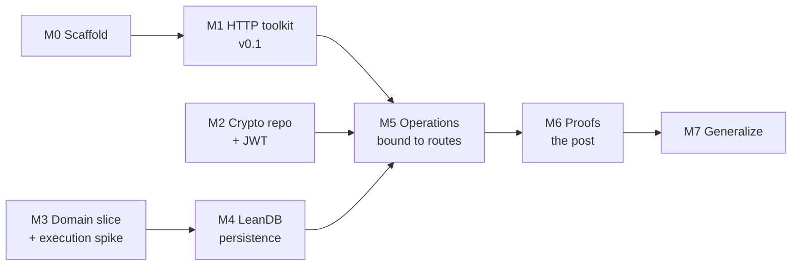

# LeanAPI: implementation plan

Status: draft, 2026-09-22. Implements [DESIGN.md](DESIGN.md), which is based on [intent.md](intent.md).

The plan ships in small releases. Each milestone ends in something usable, a tag, and ideally a short post. Open questions from DESIGN.md §12 are settled by building, not in advance. When a milestone has to pick an answer, it records the choice as a decision record in `docs/decisions/` and updates the Q table in DESIGN.md. Choices are provisional until a later milestone confirms them.

Baseline: toolchain `leanprover/lean4:v4.33.0` (matching LeanDB 0.4.0, leanhttp and leanws), transport `Std.Http.Server`, persistence LeanDB `v0.4.0` pinned by git tag.

## Overview

M1, M2 and M3 are independent and can run in parallel.

| Milestone | Ships | Settles (provisionally) | Size |
|---|---|---|---|
| M0 Scaffold | Building repo, CI, test harness | — | S |
| M1 HTTP toolkit | LeanAPI 0.1: Express-style routing, extractors, middleware, pluggable auth | Q8 (v0.1 form), part of Q7 | L |
| M2 Crypto + JWT | Crypto library 0.1; LeanAPI JWT and hashed tokens | Q10, part of Q9 | M |
| M3 Domain slice | Private-games domain in pure Lean; execution-model decision | Q1, Q2, Q3 (first answers) | M |
| M4 Persistence | LeanDB adapter with revision commits and scoped reads | Q5, part of Q6 | L |
| M5 Operations | End-to-end private-games service | Q7, existence-privacy part of Q4 | M |
| M6 Proofs | Isolation and idempotence theorems with an evidence record | Q4, Q6, Q11 (first answers) | L |
| M7 Generalize | Reusable lemmas, OpenAPI, conditional requests, typed middleware | Q12 revisited | L |

---

## M0: Scaffold

**Goal:** a repo where adding a feature means writing a module and a test.

- `lakefile.toml`, `lean-toolchain` (v4.33.0), library `LeanApi`, test executable `leanapi_tests`.
- Module skeleton following DESIGN.md §10: `LeanApi/Http`, `LeanApi/Auth`, `LeanApi/Operation`, `LeanApi/Persistence`, `LeanApi/Runtime`, `LeanApi/Proofs`. Directories are only created as they get content.
- **In-process test transport** over `Std.Http.Server.serveConnection`: send raw or structured requests and read responses without a socket. Every later milestone tests through this.
- CI (GitHub Actions): `lake build`, `lake exe leanapi_tests`. A proof audit step (`#print axioms` over a list of exported theorems, failing on `sorryAx`) is added now and populated in M6.
- `README.md` with one example; `CHANGELOG.md`; MIT license like sibling repos.

**Exit:** CI green on an empty route that returns 200 through the test transport.

---

## M1: HTTP toolkit (LeanAPI 0.1)

**Goal:** a usable Express/FastAPI-style framework with no domain layer yet. Covers the "likely needed" tier in DESIGN.md §5.3. Routes built here are plain handlers. They sit outside any proved set, which is fine for 0.1.

### M1.1 Routing
- Method + path templates with typed segments (`/games/{id}`), route groups and prefixes.
- Precedence rules. Ambiguous or duplicate routes are rejected when the router is built, and at elaboration time where feasible.
- 404 vs 405 with `Allow`; automatic `HEAD` for `GET`; `OPTIONS`.
- Trailing-slash and percent-decoding policy documented and tested.

### M1.2 Extraction and validation
- Typed extractors for path, query, headers, cookies, JSON body and form body.
- A `FromParam`/`Decode` class family whose instances call domain smart constructors (DESIGN.md §2.1), so types like `Title` plug in directly.
- Validation errors carry field locations (`body.title`, `query.page`).
- `Content-Type` checks (415) and `Accept` handling (406).
- Per-route body limits enforced while streaming, not after buffering.

### M1.3 Responses and errors
- Response builders: status, headers, JSON, text, redirects, `Set-Cookie` with attributes.
- Uniform error body (RFC 9457 `application/problem+json`). Exceptions become a 500 without internal details, with the detail logged under the request id.
- A mapping from typed handler errors to statuses, declared per route.

### M1.4 Middleware (Express-style, trusted)
- `Middleware := App → App`; ordered composition; effective order printable for inspection.
- Built-ins:
  - request id
  - structured access log
  - CORS (preflight, credentials, origin policy)
  - trusted-proxy handling of `Forwarded` / `X-Forwarded-*`
  - per-request timeout wired to the cancellation context
  - health and readiness endpoints
- **Decision record for Q8, v0.1 form:** middleware is trusted adapter code, so any later theorem lists it as an assumption.

### M1.5 Authentication interface
- `Authenticator : Request.Head → IO (Except AuthFailure Actor)`, composable per route and per group (any-of, required, optional).
- Bearer extraction and Basic parsing. Verification is a function the app supplies (token lookup, password check), so M1 needs no crypto.
- 401 with `WWW-Authenticate`; 403 kept distinct.
- The authenticator's contract is written down (DESIGN.md §6.1): what an accepted credential establishes and what it doesn't.

### M1.6 Runtime basics
- `serve` wrapper over `Std.Http.Server.serve` with config and graceful shutdown on SIGTERM.
- A helper to run blocking work (SQLite, FFI) on dedicated threads (`IO.asTask … .dedicated`) with a bounded queue, so async handlers don't pin pool threads (DESIGN.md §5.2).

### M1.7 Example and checks
- `examples/notes`: a small CRUD-ish app using every feature above, with an in-memory store.
- Concurrency check: N parallel connections against the example; verify no lost updates to the in-memory store under `Std.Mutex`.
- Load sanity check (a `wrk`/`hey` run recorded in the README, not a benchmark claim).

**Exit / ship:** tag `v0.1.0`. Post: "LeanAPI 0.1, an Express for Lean".

---

## M2: Crypto dependency and JWT

**Goal:** the missing primitives, in their own repo as `intent.md` asks, and the auth schemes that need them.

### M2.1 Crypto library (separate repo, e.g. `theoriclabs/leancrypto`)
- **Decision record for Q10:** OpenSSL FFI vs pure Lean. The leaning to test: FFI to OpenSSL 3 for anything secret-dependent (constant-time behaviour), pure Lean only for encodings.
- API:
  - SHA-256 and HMAC-SHA256
  - constant-time equality
  - secure random bytes
  - base64url (no padding) and hex
  - password hashing (scrypt or argon2id) with encoded parameters so they can be upgraded later
- Tests against the RFC 4231 (HMAC) and RFC 7914 (scrypt) test vectors.
- macOS and Linux build, including the Homebrew `openssl@3` path.
- Tag `v0.1.0`.

### M2.2 LeanAPI auth on top
- **JWT HS256:** parse, verify signature, validate `exp`/`nbf`/`iat` (with leeway), `iss`, `aud`; reject `alg: none` and unexpected algorithms. Claims → `Actor` through an app-supplied mapping.
- **Opaque bearer tokens:** generation plus storage as a SHA-256 digest, looked up by indexed digest (never "load all and filter").
- **Basic:** verifier built on the password hash.
- **Q9 decision record, partial:** which session and account model LeanAPI provides out of the box versus leaves to apps. The default to try: provide mechanisms only; accounts belong to the app's own domain.
- RS256/ES256 and JWKS fetch (via leanhttp) are listed as follow-ups.

**Exit / ship:** crypto `v0.1.0`, LeanAPI `v0.2.0`. Post: "JWT and password auth for Lean".

---

## M3: Domain slice and execution spike

**Goal:** DESIGN.md §11 steps 1 and 2. Write the private-games domain with no HTTP and no SQL, then try it through at least two execution interfaces before choosing one.

### M3.1 Domain (`examples/private-games/Domain`)
- Values: `PlayerId`, `GameId`, `Move`, `Revision`, `TimeControl`.
- Game state, legality (reuse or port leanchess `domain/` rules if convenient, simplified if not), outcomes.
- Operations: `OpenGame`, `ReadGame`, `ListMyGames`, `PlayMove(expectedRevision)`, `Resign`.
- Policy: participant-only visibility and action.
- Specs from DESIGN.md §2.4 stated as Lean `Prop`s: `Valid`, `Allowed`, `Transition`.
- Proofs at the domain level: invariant preservation for `PlayMove` and `Resign`; state idempotence of `Resign`.

### M3.2 Execution spike (Q1)
Implement `PlayMove` and `ListMyGames` through two candidates, each far enough to judge:
- **(a)** A pure `decide` function inside an effectful shell that loads, checks and commits.
- **(b)** Handlers written in a small effect language (`Op` inductive with read, commit and similar), interpreted over an in-memory store.

For each, try writing one custom theorem, one query with pagination, and one external-effect intent. Record the ergonomics, what "all code paths" covers, and the cost of the escape hatch.

### M3.3 Representation choices
- **Q2:** proof fields vs private constructors for values, based on how M1 extractors and M4 codecs feel with each.
- **Q3:** state-based storage with a revision for the first slice. An event log is noted as a later option, not built.

**Exit:** decision records for Q1, Q2 and Q3; domain theorems compiling with no `sorry`. No release. The spike code stays in `examples/` or is deleted.

---

## M4: Persistence on LeanDB

**Goal:** the persistence contracts from DESIGN.md §7.2, implemented for the selected execution model.

- **Mapping:** game state ↔ LeanDB entities (`deriving LeanDb.Entity`). Column codecs built from the same domain constructors, and a round-trip law proved per value type.
- **Reconstruction:** loading re-validates; invalid stored data becomes a typed error, never a crash.
- **Commit against a revision:** LeanDB compare-and-swap `update`/`append` inside `transaction`. `.stale` maps to a typed conflict.
- **Scoped reads:** the only read path for protected entities is a repository function that takes authority and builds the LeanDB `Pred` with the policy conjoined. The raw connection is not exported to handlers (DESIGN.md §6.3; which property this actually gives is settled in M6).
- **Retry receipts:** a receipt table keyed by (actor, operation, key) and written in the same transaction as the state change. Reuse with a different input is rejected. Concurrent submissions of the same key are resolved by the transaction.
- **Runtime:** a single writer queue plus a pool of read-only connections, run through the M1.6 blocking-work helper.
- **Q5 decision record:** snapshot and revision semantics, and when authority is checked relative to commit (revocation between check and commit).
- **Tests:**
  - two connections racing on one game revision
  - a restart after commit but before response, with the retry returning the receipt
  - a stored row that fails validation
  - differential checks of LeanDB-backed operations against the in-memory store from M3

**Exit:** persistence adapter merged. No release on its own; it ships with M5.

---

## M5: Operations bound to routes

**Goal:** the complete request path from DESIGN.md §3.3, running natively for private games.

- **Binding:** an operation → route binding (explicit, per Q7's first answer). It declares inputs from path, query, header and body; the authenticator; the error → status mapping; and the public projection of the result.
- **Authority flow:** the authenticated actor goes into the operation's execution scope; handlers cannot construct it.
- **Existence privacy (part of Q4):** the default to try is that "exists but not visible" returns the same response as "does not exist", with a per-route override.
- **Headers:** `Idempotency-Key` extraction; `ETag` from the revision on reads and `If-Match` → expected revision on `PlayMove`.
- **Service:** `examples/private-games` as a runnable server with the routes from DESIGN.md §9.2, a seed script, and a Dockerfile following leanchess `deploy/`.
- **Tests:** full HTTP tests for every case in DESIGN.md §9.3:
  - unauthorized vs missing ids
  - stale revision
  - simultaneous moves
  - revocation between admission and commit
  - key reuse with a different body

**Exit / ship:** LeanAPI `v0.3.0` with the example deployed. Post: "Domain-first endpoints in LeanAPI".

---

## M6: Proofs (the post from intent.md)

**Goal:** the two motivating guarantees, proved for the private-games service at a stated scope, with honest labeling.

- **Reference model:** `step : Request → World → Response × World` for the exported routes. It covers every modeled branch (route miss, decode failure, auth failure, policy denial, conflict, success). `World` holds game state, receipts and sessions. Under the M3 execution choice, the model runs the same decision functions the native service runs.
- **Q4 decision record:** which isolation property is claimed. Candidates, from DESIGN.md §6.3:
  - authorized output
  - single-request response noninterference over a defined observation (status, headers, body, errors, counts)
  - restricted logical reads

  The claim is written down before proving it.
- **Theorems, for the exported routes of private games:**
  1. Isolation as chosen above.
  2. Availability: a participant's read of their game succeeds under stated preconditions.
  3. Keyed idempotence: replaying `PlayMove` with the same key and input returns the recorded outcome and leaves the world unchanged.
  4. State idempotence of `Resign`.
  5. Reads do not change domain state.
- **Q6 decision record:** the idempotence contract (key scope, input identity, retention, replay under revoked authority).
- **Evidence record (Q11):** `EVIDENCE.md` listing each claim as proved, checked, assumed or open. It names the assumptions: the authenticator contract, `Std.Http` parsing, LeanDB/SQLite execution, native ≡ model (checked by differential tests), and middleware as trusted code.
- **CI:** the axiom audit covers every listed theorem. A spec change shows up as its own diff (spec files kept separate from proofs).

**Exit / ship:** LeanAPI `v0.4.0`. Post: the one dictated in `intent.md`, with the precise claims from `EVIDENCE.md`.

---

## M7: Generalize

**Goal:** turn the private-games proofs into framework features other apps can use, and broaden HTTP coverage.

- **Reusable lemmas:** lift the M6 proofs into statements parameterized by an app's policies and bindings, so a new app discharges only domain-level obligations. Start with a second small example (e.g. notes with sharing) to test that the lemmas are general.
- **Coverage enforcement:** exported routes outside the proved set are reported at build time (Q1/Q11 escape-hatch policy).
- **Typed middleware stages (Q8, second form):** middleware that declares what it establishes and what it may observe, so it can enter theorems instead of being assumed.
- **Tier-2 HTTP features** from DESIGN.md §5.3:
  - conditional requests beyond `If-Match`
  - OpenAPI generation from bindings, plus a docs page
  - rate limiting
  - SSE
  - security headers
  - multipart
  - tracing
- **Q12 revisit:** write down what 1.0 means.

---

## Later, not scheduled

- Trace noninterference across request sequences and several actors.
- Event-sourced storage as an alternative mapping.
- Durable effects: outbox, worker, delivery states (DESIGN.md §7.3).
- WebSocket and SSE subscriptions with authority contracts (leanws).
- Migrations that carry invariant proofs; API versioning.
- Porting leanchess onto LeanAPI.
- RS256/ES256/JWKS; MFA and account recovery as example domains.

## Risks

| Risk | Mitigation |
|---|---|
| The execution model chosen in M3 makes ordinary handlers painful | M3 compares candidates on real operations before committing; M1 keeps plain handlers available as unproved routes |
| Proofs about the model drift from native behavior | Same decision functions in both; differential tests in CI; the gap stays listed in `EVIDENCE.md` |
| `Std.Http` changes between toolchains | Pin the toolchain; bump it with LeanDB in lockstep; keep the transport behind one module |
| SQLite write throughput | Single writer queue with backpressure; measure in M4; state limits in docs |
| Crypto misuse | FFI to a vetted library for secret-dependent code; RFC test vectors; no custom primitives |
| Overclaiming in posts | Posts quote `EVIDENCE.md`, not summaries |
