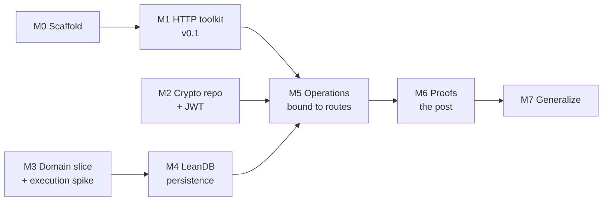
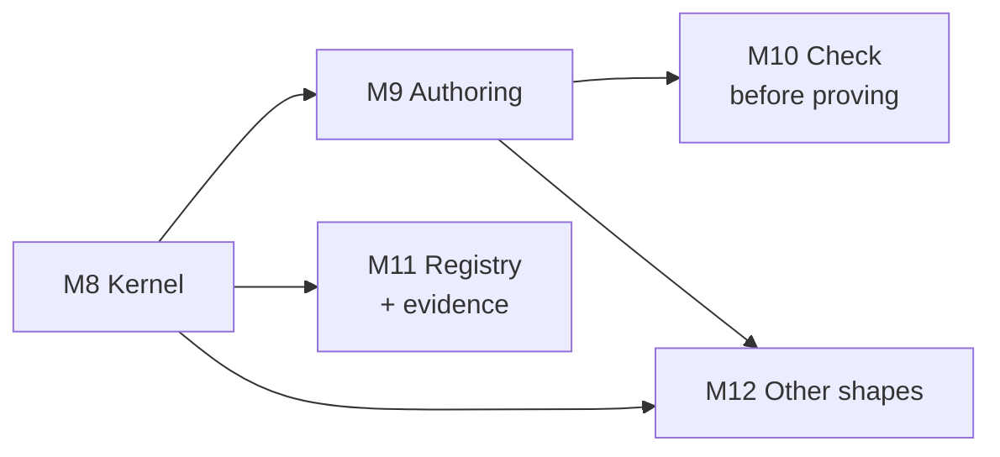
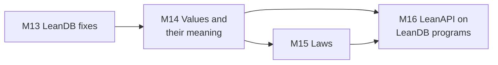

# LeanAPI: implementation plan

Status: M0–M7 shipped (0.1.0–0.5.0); M8–M12 shipped as 0.6.0, 2026-09-23. Implements [DESIGN.md](DESIGN.md), which is based on [intent.md](intent.md).

The plan ships in small releases. Each milestone ends in something usable, a tag, and ideally a short post. Open questions from DESIGN.md §12 are settled by building, not in advance. When a milestone has to pick an answer, it records the choice as a decision record in `docs/decisions/` and updates the Q table in DESIGN.md. Choices are provisional until a later milestone confirms them.

Baseline: toolchain `leanprover/lean4:v4.33.0` (matching LeanDB 0.4.0, leanhttp and leanws), transport `Std.Http.Server`, persistence LeanDB `v0.4.0` pinned by git tag.

## Overview



M1, M2 and M3 are independent and can run in parallel.

| Milestone | Ships | Settles (provisionally) | Size |
|---|---|---|---|
| M0 Scaffold | Building repo, CI, test harness | — | S |
| M1 HTTP toolkit | LeanAPI 0.1: Express-style routing, extractors, middleware, pluggable auth | Q8 (v0.1 form), part of Q7 | L |
| M2 Crypto + JWT | Crypto library 0.1; LeanAPI JWT and hashed tokens | Q10, part of Q9 | M |
| M3 Domain slice | Private-games domain in pure Lean; execution-model decision | Q1, Q2, Q3 (first answers) | M |
| M4 Persistence | LeanDB adapter with revision commits and scoped reads | Q5, part of Q6 | L |
| M5 Operations | End-to-end private-games service | Q7, existence-privacy part of Q4 | M |
| M6 Proofs | Isolation and idempotence theorems with an evidence record | Q4, Q6, Q11 (first answers) | L |
| M7 Generalize | Reusable lemmas, OpenAPI, conditional requests, typed middleware | Q12 revisited | L |

---

## M0: Scaffold

**Goal:** a repo where adding a feature means writing a module and a test.

- `lakefile.toml`, `lean-toolchain` (v4.33.0), library `LeanApi`, test executable `leanapi_tests`.
- Module skeleton following DESIGN.md §10: `LeanApi/Http`, `LeanApi/Auth`, `LeanApi/Operation`, `LeanApi/Persistence`, `LeanApi/Runtime`, `LeanApi/Proofs`. Directories are only created as they get content.
- **In-process test transport** over `Std.Http.Server.serveConnection`: send raw or structured requests and read responses without a socket. Every later milestone tests through this.
- CI (GitHub Actions): `lake build`, `lake exe leanapi_tests`. A proof audit step (`#print axioms` over a list of exported theorems, failing on `sorryAx`) is added now and populated in M6.
- `README.md` with one example; `CHANGELOG.md`; MIT license like sibling repos.

**Exit:** CI green on an empty route that returns 200 through the test transport.

---

## M1: HTTP toolkit (LeanAPI 0.1)

**Goal:** a usable Express/FastAPI-style framework with no domain layer yet. Covers the "likely needed" tier in DESIGN.md §5.3. Routes built here are plain handlers. They sit outside any proved set, which is fine for 0.1.

### M1.1 Routing
- Method + path templates with typed segments (`/games/{id}`), route groups and prefixes.
- Precedence rules. Ambiguous or duplicate routes are rejected when the router is built, and at elaboration time where feasible.
- 404 vs 405 with `Allow`; automatic `HEAD` for `GET`; `OPTIONS`.
- Trailing-slash and percent-decoding policy documented and tested.

### M1.2 Extraction and validation
- Typed extractors for path, query, headers, cookies, JSON body and form body.
- A `FromParam`/`Decode` class family whose instances call domain smart constructors (DESIGN.md §2.1), so types like `Title` plug in directly.
- Validation errors carry field locations (`body.title`, `query.page`).
- `Content-Type` checks (415) and `Accept` handling (406).
- Per-route body limits enforced while streaming, not after buffering.

### M1.3 Responses and errors
- Response builders: status, headers, JSON, text, redirects, `Set-Cookie` with attributes.
- Uniform error body (RFC 9457 `application/problem+json`). Exceptions become a 500 without internal details, with the detail logged under the request id.
- A mapping from typed handler errors to statuses, declared per route.

### M1.4 Middleware (Express-style, trusted)
- `Middleware := App → App`; ordered composition; effective order printable for inspection.
- Built-ins:
  - request id
  - structured access log
  - CORS (preflight, credentials, origin policy)
  - trusted-proxy handling of `Forwarded` / `X-Forwarded-*`
  - per-request timeout wired to the cancellation context
  - health and readiness endpoints
- **Decision record for Q8, v0.1 form:** middleware is trusted adapter code, so any later theorem lists it as an assumption.

### M1.5 Authentication interface
- `Authenticator : Request.Head → IO (Except AuthFailure Actor)`, composable per route and per group (any-of, required, optional).
- Bearer extraction and Basic parsing. Verification is a function the app supplies (token lookup, password check), so M1 needs no crypto.
- 401 with `WWW-Authenticate`; 403 kept distinct.
- The authenticator's contract is written down (DESIGN.md §6.1): what an accepted credential establishes and what it doesn't.

### M1.6 Runtime basics
- `serve` wrapper over `Std.Http.Server.serve` with config and graceful shutdown on SIGTERM.
- A helper to run blocking work (SQLite, FFI) on dedicated threads (`IO.asTask … .dedicated`) with a bounded queue, so async handlers don't pin pool threads (DESIGN.md §5.2).

### M1.7 Example and checks
- `examples/notes`: a small CRUD-ish app using every feature above, with an in-memory store.
- Concurrency check: N parallel connections against the example; verify no lost updates to the in-memory store under `Std.Mutex`.
- Load sanity check (a `wrk`/`hey` run recorded in the README, not a benchmark claim).

**Exit / ship:** tag `v0.1.0`. Post: "LeanAPI 0.1, an Express for Lean".

---

## M2: Crypto dependency and JWT

**Goal:** the missing primitives, in their own repo as `intent.md` asks, and the auth schemes that need them.

### M2.1 Crypto library (separate repo, e.g. `theoriclabs/leancrypto`)
- **Decision record for Q10:** OpenSSL FFI vs pure Lean. The leaning to test: FFI to OpenSSL 3 for anything secret-dependent (constant-time behaviour), pure Lean only for encodings.
- API:
  - SHA-256 and HMAC-SHA256
  - constant-time equality
  - secure random bytes
  - base64url (no padding) and hex
  - password hashing (scrypt or argon2id) with encoded parameters so they can be upgraded later
- Tests against the RFC 4231 (HMAC) and RFC 7914 (scrypt) test vectors.
- macOS and Linux build, including the Homebrew `openssl@3` path.
- Tag `v0.1.0`.

### M2.2 LeanAPI auth on top
- **JWT HS256:** parse, verify signature, validate `exp`/`nbf`/`iat` (with leeway), `iss`, `aud`; reject `alg: none` and unexpected algorithms. Claims → `Actor` through an app-supplied mapping.
- **Opaque bearer tokens:** generation plus storage as a SHA-256 digest, looked up by indexed digest (never "load all and filter").
- **Basic:** verifier built on the password hash.
- **Q9 decision record, partial:** which session and account model LeanAPI provides out of the box versus leaves to apps. The default to try: provide mechanisms only; accounts belong to the app's own domain.
- RS256/ES256 and JWKS fetch (via leanhttp) are listed as follow-ups.

**Exit / ship:** crypto `v0.1.0`, LeanAPI `v0.2.0`. Post: "JWT and password auth for Lean".

---

## M3: Domain slice and execution spike

**Goal:** DESIGN.md §11 steps 1 and 2. Write the private-games domain with no HTTP and no SQL, then try it through at least two execution interfaces before choosing one.

### M3.1 Domain (`examples/private-games/Domain`)
- Values: `PlayerId`, `GameId`, `Move`, `Revision`, `TimeControl`.
- Game state, legality (reuse or port leanchess `domain/` rules if convenient, simplified if not), outcomes.
- Operations: `OpenGame`, `ReadGame`, `ListMyGames`, `PlayMove(expectedRevision)`, `Resign`.
- Policy: participant-only visibility and action.
- Specs from DESIGN.md §2.4 stated as Lean `Prop`s: `Valid`, `Allowed`, `Transition`.
- Proofs at the domain level: invariant preservation for `PlayMove` and `Resign`; state idempotence of `Resign`.

### M3.2 Execution spike (Q1)
Implement `PlayMove` and `ListMyGames` through two candidates, each far enough to judge:
- **(a)** A pure `decide` function inside an effectful shell that loads, checks and commits.
- **(b)** Handlers written in a small effect language (`Op` inductive with read, commit and similar), interpreted over an in-memory store.

For each, try writing one custom theorem, one query with pagination, and one external-effect intent. Record the ergonomics, what "all code paths" covers, and the cost of the escape hatch.

### M3.3 Representation choices
- **Q2:** proof fields vs private constructors for values, based on how M1 extractors and M4 codecs feel with each.
- **Q3:** state-based storage with a revision for the first slice. An event log is noted as a later option, not built.

**Exit:** decision records for Q1, Q2 and Q3; domain theorems compiling with no `sorry`. No release. The spike code stays in `examples/` or is deleted.

---

## M4: Persistence on LeanDB

**Goal:** the persistence contracts from DESIGN.md §7.2, implemented for the selected execution model.

- **Mapping:** game state ↔ LeanDB entities (`deriving LeanDb.Entity`). Column codecs built from the same domain constructors, and a round-trip law proved per value type.
- **Reconstruction:** loading re-validates; invalid stored data becomes a typed error, never a crash.
- **Commit against a revision:** LeanDB compare-and-swap `update`/`append` inside `transaction`. `.stale` maps to a typed conflict.
- **Scoped reads:** the only read path for protected entities is a repository function that takes authority and builds the LeanDB `Pred` with the policy conjoined. The raw connection is not exported to handlers (DESIGN.md §6.3; which property this actually gives is settled in M6).
- **Retry receipts:** a receipt table keyed by (actor, operation, key) and written in the same transaction as the state change. Reuse with a different input is rejected. Concurrent submissions of the same key are resolved by the transaction.
- **Runtime:** a single writer queue plus a pool of read-only connections, run through the M1.6 blocking-work helper.
- **Q5 decision record:** snapshot and revision semantics, and when authority is checked relative to commit (revocation between check and commit).
- **Tests:**
  - two connections racing on one game revision
  - a restart after commit but before response, with the retry returning the receipt
  - a stored row that fails validation
  - differential checks of LeanDB-backed operations against the in-memory store from M3

**Exit:** persistence adapter merged. No release on its own; it ships with M5.

---

## M5: Operations bound to routes

**Goal:** the complete request path from DESIGN.md §3.3, running natively for private games.

- **Binding:** an operation → route binding (explicit, per Q7's first answer). It declares inputs from path, query, header and body; the authenticator; the error → status mapping; and the public projection of the result.
- **Authority flow:** the authenticated actor goes into the operation's execution scope; handlers cannot construct it.
- **Existence privacy (part of Q4):** the default to try is that "exists but not visible" returns the same response as "does not exist", with a per-route override.
- **Headers:** `Idempotency-Key` extraction; `ETag` from the revision on reads and `If-Match` → expected revision on `PlayMove`.
- **Service:** `examples/private-games` as a runnable server with the routes from DESIGN.md §9.2, a seed script, and a Dockerfile following leanchess `deploy/`.
- **Tests:** full HTTP tests for every case in DESIGN.md §9.3:
  - unauthorized vs missing ids
  - stale revision
  - simultaneous moves
  - revocation between admission and commit
  - key reuse with a different body

**Exit / ship:** LeanAPI `v0.3.0` with the example deployed. Post: "Domain-first endpoints in LeanAPI".

---

## M6: Proofs (the post from intent.md)

**Goal:** the two motivating guarantees, proved for the private-games service at a stated scope, with honest labeling.

- **Reference model:** `step : Request → World → Response × World` for the exported routes. It covers every modeled branch (route miss, decode failure, auth failure, policy denial, conflict, success). `World` holds game state, receipts and sessions. Under the M3 execution choice, the model runs the same decision functions the native service runs.
- **Q4 decision record:** which isolation property is claimed. Candidates, from DESIGN.md §6.3:
  - authorized output
  - single-request response noninterference over a defined observation (status, headers, body, errors, counts)
  - restricted logical reads

  The claim is written down before proving it.
- **Theorems, for the exported routes of private games:**
  1. Isolation as chosen above.
  2. Availability: a participant's read of their game succeeds under stated preconditions.
  3. Keyed idempotence: replaying `PlayMove` with the same key and input returns the recorded outcome and leaves the world unchanged.
  4. State idempotence of `Resign`.
  5. Reads do not change domain state.
- **Q6 decision record:** the idempotence contract (key scope, input identity, retention, replay under revoked authority).
- **Evidence record (Q11):** `EVIDENCE.md` listing each claim as proved, checked, assumed or open. It names the assumptions: the authenticator contract, `Std.Http` parsing, LeanDB/SQLite execution, native ≡ model (checked by differential tests), and middleware as trusted code.
- **CI:** the axiom audit covers every listed theorem. A spec change shows up as its own diff (spec files kept separate from proofs).

**Exit / ship:** LeanAPI `v0.4.0`. Post: the one dictated in `intent.md`, with the precise claims from `EVIDENCE.md`.

---

## M7: Generalize

**Goal:** turn the private-games proofs into framework features other apps can use, and broaden HTTP coverage.

- **Reusable lemmas:** lift the M6 proofs into statements parameterized by an app's policies and bindings, so a new app discharges only domain-level obligations. Start with a second small example (e.g. notes with sharing) to test that the lemmas are general.
- **Coverage enforcement:** exported routes outside the proved set are reported at build time (Q1/Q11 escape-hatch policy).
- **Typed middleware stages (Q8, second form):** middleware that declares what it establishes and what it may observe, so it can enter theorems instead of being assumed.
- **Tier-2 HTTP features** from DESIGN.md §5.3:
  - conditional requests beyond `If-Match`
  - OpenAPI generation from bindings, plus a docs page
  - rate limiting
  - SSE
  - security headers
  - multipart
  - tracing
- **Q12 revisit:** write down what 1.0 means.

---

## The property library (M8–M12), shipped as 0.6.0

M0–M7 shipped as 0.1.0–0.5.0. M8–M12 implement [docs/PROPERTIES.md](docs/PROPERTIES.md) and shipped together as 0.6.0. Decisions: 0016 (P1), 0017 (P2, P6, P7), 0018 (P3), 0019 (P4, P5).

**As built, compared with this plan:**

- M8: as planned. `ListStore` (the entity → system lift) landed in M8 because the `uniqueIds` demonstrator needed it.
- M9: `EntityStore` is `ListStore` (list-shaped stores only). LeanDB 0.4.0 has no `@[leandb_invariant]` hook, so the P7 adapter is `StoredInvariant`, called by the repository inside its transaction (decision 0017). The README snippet check is `scripts/check_readme.sh` in CI.
- M10: Plausible builds on 4.33 but cannot derive generators for proof-carrying fields, so the library has its own `Enumerate` (decision 0018). The C1 regression is a hiddenness-witness check (`checkHidden`), run on data views.
- M11: as planned. The registry lives in `LeanApi/Props/Registry.lean`, the app's claims in `PrivateGames/Evidence.lean`.
- M12 exit, partly met. `reads_pure` is replaced by the library (`safe_of_pure_plans`), and keyed replay is generic (`Keyed`) and proved after interleavings for the model itself (`keyed_replay_after`). Still hand-written: the per-caller isolation obligations (`gamesApp_caller_obligations`, which is what the library asks an app to prove), and the domain lemmas `Allowed`/`Transition`, which have no library shape.
- M12: trace noninterference is proved for a **coalition** of players sending requests in any order. Requests from outside the coalition stay open (decision 0019, P5). The keyed theorems are proved for the `Keyed` transformer over the model with a list ledger. That the LeanDB receipt table satisfies `LedgerLaws` is checked, not proved.

**Goal:** make invariants easy to define. Today an author writes four things by hand, and private-games shows the cost (`Domain/Game.lean`, `Domain/Proofs.lean`):
- a `Prop` (`Valid`) and a matching `Bool` check (`validB`);
- a proof that they agree (`validB_iff`);
- a preservation proof per command;
- a runtime check wired into storage.

Beyond that, the lift to "every stored game is valid" is not proved at all; storage only checks it at runtime.

The target authoring experience:

```lean
invariant Game.Valid (g : Game) where
  distinct : g.x ≠ g.o
  nodup    : (g.moves.map (·.i)).Nodup
  history  : Rules.legalHistory g.moves
  length   : g.moves.length ≤ 9

preserves Game.Valid by decide, openGame   -- generates one obligation per command
```

From that, the library produces:
- the decidable check, which reports which field failed;
- the runtime validation used by storage;
- the per-command obligations, discharged by an `invariant_cases` tactic where they are routine;
- the lift to a whole-system invariant;
- a counterexample search to run before anyone writes a proof.



| Milestone | Ships | Settles (PROPERTIES.md §8) | Size |
|---|---|---|---|
| M8 Kernel | `LeanApi.Props`: systems, invariants, induction, the operator algebra | P1 | M |
| M9 Authoring | `invariant` and `preserves` commands, derived checks, entity → system lift | P2, P6, P7 | L |
| M10 Check before proving | `#check_invariant`: well-formedness, vacuity, counterexample search | P3 | M |
| M11 Registry and evidence | Property registry, generated evidence tables, coverage of writers | — | M |
| M12 Other shapes | Safe, step, relational and keyed properties on the kernel | P4, P5 | L |

### M8: Kernel

**Goal:** the generic theory from PROPERTIES.md §2 and §6, proved once, with no automation yet.

- **`LeanApi/Props/Sys.lean`:** `Sys` (world, request, response, environment, `step`, `init`), `Reachable`, `Invariant`, `Inductive`, `Invariant.of_inductive`.
- **Operators with their proved rules (§6.3):**
  - conjunction, including the relative form (`J` inductive given `I`)
  - disjunction
  - indexed conjunction and disjunction, with the frame-based local form
  - pullback along a simulation
  - union of transition sources (one obligation per writer)
- **`Inductive.restrict`:** the subsystem on `{w // I w}` (§6.2).
- **Canonical strengthening (§6.5):** `pre`, `WeakestInductive` (defined as "every run from `w` stays in `I`"), `invariant_iff`, and a `CTI` structure for counterexamples to induction.
- **Bridge:** `ScopedApp.toSys`, so existing apps are `Sys` instances.
- **Demonstrator.** Prove two system-level invariants of private-games that are currently only checked at runtime:
  1. Every stored game is `Valid`.
  2. Game ids are unique. This needs the strengthening `∀ g ∈ w.games, g.id < w.nextGame`, which makes it the worked example of §6.5.
- **Audit:** every kernel theorem is added to `scripts/audited_theorems.txt`.

**Exit:** the two private-games invariants proved through the kernel and listed in EVIDENCE.md as Proved.

### M9: Authoring

**Goal:** the target authoring experience above.

- **`invariant` command.** Takes a structure of fields and generates:
  - the `Prop` structure;
  - a `Decidable` instance;
  - `check : α → Except (List String) Unit`, naming the failing fields;
  - `check_iff`;
  - a registry entry.

  Fields must be decidable. A non-decidable field is an error that names the field and suggests either a `Decidable` instance or marking the field `proof_only`, which leaves it out of the runtime check.
- **`preserves I by f₁, f₂, …` command.** Generates one theorem statement per decision function, in the shape `I s → f … s = .ok s' → I s'`. It tries `invariant_cases` on each and leaves the rest as named goals, listing them clearly.
- **`invariant_cases` tactic.**
  - Unfolds the decision and splits on its `if`/`match` branches.
  - Closes refusal branches.
  - Closes each invariant field that the transition doesn't touch, using a frame lemma or `simp`.
  - Leaves the remaining goals per field and branch, so the author sees exactly which rule each branch must re-establish.
- **Entity → system lift.**
  - A store is described by an `EntityStore` interface (where entities live, and which ones a plan writes).
  - An entity invariant plus the `preserves` obligations then gives the system invariant from M8, with no further proof.
  - Supported first for list- and map-shaped stores.
- **Runtime check from the same definition (P7).**
  - The private-games repository calls the generated `check` on load and before write, replacing `validB`.
  - An optional adapter emits LeanDB's `@[leandb_invariant]` from the same check, so the runtime check and the proved property cannot drift.
- **Migration and docs:**
  - Rewrite private-games `Valid` and its preservation proofs with the new commands. The audit must stay green, and the line count should drop.
  - Update the README `Board` example to use `invariant` and `preserves`.
  - Add a README snippet check to the test suite, so documented examples keep compiling.

**Exit:** a new entity invariant with routine preservation takes one declaration plus one `preserves` line. The private-games migration is merged with the audit passing.

### M10: Check before proving

**Goal:** tell the author that an invariant is ill-formed, vacuous or not inductive before they spend time on a proof (PROPERTIES.md §5.2, §6.4, §6.5).

- **`#check_invariant I` reports:**
  - **Well-formedness:** carrier, decidability, and a warning when an invariant over a `List` isn't shown to respect permutation (§6.4, representation independence).
  - **Vacuity:** a satisfying initial world, and a world that violates `I`. If `I` is `True`, or admits no initial world, the command says so.
  - **Counterexamples to induction:** found by bounded search over small worlds. The command reports the world, the request and the violated field, and says whether it could tell the world is reachable.
  - **Next candidate strengthening:** it offers `I ∧ pre I` (§6.5).
- **Generators.** A small `Enumerate`/`Sample` class for domain types, derived for inductives and structures.
  - **Spike first:** check whether Plausible builds on toolchain 4.33. If it does, use it; if not, keep our own small generator. Record the choice as a decision (P3).
- **Regression targets.** The command must find:
  - the "unique ids without `Fresh`" counterexample from M8;
  - the review's C1-style vacuity. An observation whose view determines the world fails the hiddenness-witness check.

**Exit:** both regression targets reported automatically, with tests.

### M11: Registry and evidence

**Goal:** properties are data that tools can list, so the evidence record can't claim more than the checked theorems say.

- **Registry.** An environment extension recording each property: shape, statement, status (proved, checked, assumed or open), theorem name, and the routes or writers it covers.
- **`#properties` command** prints the registry.
- **Generated evidence.** A script generates EVIDENCE.md's claim tables from the registry and the axiom audit. The prose sections stay hand-written.
- **Writer coverage.** Every route and writer (jobs and admin commands too) must discharge each system invariant it can touch, or be listed as unproved. The build fails on drift, closing the EVIDENCE.md open item "coverage enforced by the build itself".

**Exit:** EVIDENCE.md's proved rows are generated. Removing a theorem or adding an uncovered writer fails CI.

### M12: Other shapes on the kernel

**Goal:** the rest of PROPERTIES.md §4, each as an invariant of a derived system (§6.1).

- **`Safe`.** Discharged automatically for plans with no writes. This replaces the hand proof of `reads_pure`.
- **Step properties.** `Monotone` (move logs only grow, revisions only increase) and `Frame`, via the transition-augmented system.
- **Noninterference over projections.**
  - Restated over projections, with a hiddenness witness required.
  - Always paired with an `Enabled` property.
  - A successor-view clause for one caller (an EVIDENCE.md open item).
- **Generic keyed idempotence.** A `Keyed` system transformer with `LedgerLaws`, proved once for the LeanDB receipt table. It covers replay after intervening requests. This closes two EVIDENCE.md open items: the app-generic keyed theorem, and replay after other requests.
- **Trace noninterference** via unwinding, for sequences of requests from several actors (an open item).

**Exit:** private-games' remaining hand-written proofs are re-expressed through the library, and the open items above move to Proved.

### Risks for M8–M12

| Risk | Mitigation |
|---|---|
| Metaprogramming (`invariant`, `preserves`, `invariant_cases`) becomes the hard part | M8 is usable without any of it. Commands generate plain definitions and theorem statements a user could write by hand. Keep generated code readable |
| Counterexample search is slow or finds nothing useful | Bounded, opt-in, reports what it searched. Proofs never depend on it |
| The kernel's `Sys` doesn't fit real apps | M8 must instantiate private-games through `ScopedApp.toSys` before M9 starts |
| Generated evidence hides nuance | Only claim tables are generated; scopes and assumptions stay hand-written prose |

## Next: one API over LeanDB (M13–M16)

The design is [docs/QUERIES.md](docs/QUERIES.md). **The goal:** each endpoint is one definition over LeanDB query and transaction *values*. Its pure meaning is what the API proofs are about, and LeanDB runs the same value in production. The only trusted step is LeanDB's: executing a value equals its meaning. That carries every API theorem to the running service.

M13–M15 are LeanDB work, in the LeanDB repository (`theoriclabs/LeanDB`), as LDB tickets. M16 is LeanAPI work, on the new LeanDB release.



| Milestone | Where | Ships | Size |
|---|---|---|---|
| M13 Fixes | LeanDB | The seven bugs of QUERIES.md §6 | S |
| M14 Values | LeanDB | `DbState`, `Query`/`Agg`, `WriteOp`, `Prog`/`Reads`/`Txn`, their meaning and compilation, the execution-equals-meaning differential harness | L |
| M15 Laws | LeanDB | Exact plans, aggregates, codec laws, frame lemmas, well-formedness preservation, write algebra, `run = denote` | L |
| M16 LeanAPI | LeanAPI | `Reads`/`Writes` as LeanDB programs, private-games on the schema, theorems re-established, `Model/` and the hand-written service deleted | L |

### M13: LeanDB fixes

Independent of the new language, and worth shipping first. Each gets a regression test.

1. Apply `order`/`window` after the residual filter unless the plan is exact. Fixes the `existsP` false negatives and pagination (`Db.lean:629`, `:1164`, `:1168`).
2. Make `SqlOrd` lawful: bound `Nat` columns or remove `SqlOrd Nat` (`Core.lean:245-254`).
3. `Runtime.Service.withReader`: lock readers per connection; never hand out the writer connection as a reader (`Runtime.lean:162-176`).
4. SAVEPOINT around multi-statement verbs that join an outer transaction (`Db.lean:387`).
5. Reject opaque leaves in `patch` guards (`Db.lean:1195`).
6. `count`/`exists?`: honour the lambda's residual, or refuse non-exact plans (`Db.lean:1158`, `:1176`).
7. `Snapshot.rows`: fail on undecodable rows instead of dropping them (`Pred.lean:197-201`).
8. Publish the deferred read snapshot (currently private, `Db.lean:380`); LeanAPI's `Repo.readSnapshot` then goes away.

**Exit:** a LeanDB release with the fixes. LeanAPI pins it and all its tests pass.

### M14: Values and their meaning

- **Pure database state.** `DbState` holds, per table, the AUTOINCREMENT counter and the rows in id order, with child lists. Also `DbState.WF`: every row decodes, satisfies its invariant, and every constraint holds.
- **Queries.** `Query ts` holds a `Pred`, typed order keys ending in the id, and a `Window`; `Agg` is `rows`, `count`, `exists` or `first`. The meaning extends `selectSpec`. The SQL pushes the window and aggregate only for exact plans.
- **Typed schema symbols.** Unique indexes become declarations (`unique User.byName := name`), generating:
  - `Unique α`, with a `Key` type per index;
  - `ForeignKey α` from `Ref` fields, `ListField α`, `ReferencedBy s α`;
  - `Checked α`, a value with its invariant.
- **Reads.** `get`, `lookup`, `first`, `all`, `page`, `count`, `exists`, typed by result (`Option (Stored α)`, `List`, `Page`, `Nat`, `Bool`), with no failure channel. Typed joins follow declared foreign keys.
- **Writes, each with its own failure type derived from the schema** (QUERIES.md §3.3):
  - `insert` fails with `InsertError`; `update` (compare-and-swap) with `UpdateError`, including `stale current`.
  - `set`/`patch` on rows read in the transaction fail with `SetError α fs`: no `stale`, and only the constraints over the written fields `fs`.
  - `append` fails with `AppendError`, `delete` with `DeleteError` naming who references the row.
  - Writes take `Checked α`, built at runtime by `check` or from a proof by `Checked.of`.
- **Meaning.** Each write's meaning is `DbState → Except E (β × DbState)`. It models id assignment, compare-and-swap with `IS` semantics, list growth, unique/reference/restrict/cascade and enum checks, and the declared order in which failures are reported.
- **Programs.** `Read s α` has no write constructor and no failure; `Txn s ε α` declares its failure type and is all or nothing (`throw`, `orAbort`, `orElse`). `Current α` handles cannot leave their transaction. `Read` executes in one deferred transaction; `Txn` under `BEGIN IMMEDIATE`, with a SAVEPOINT per write, and constraints checked explicitly in the declared order.
- **Faults.** `DbFault` (locking, I/O, corruption, schema mismatch) is outside every program type: the request aborts with no effect.
- **Surface syntax.** The lambda form of `select` elaborates to a `Query` and is refused when it cannot be planned exactly where exactness matters (windows, counts).
- **The execution-equals-meaning harness.** Random well-formed `DbState`s and random `Query`/`WriteOp`/`Prog` values run against SQLite and against `denote`; results and final states are compared. It ships in LeanDB and runs in its CI.

**Exit:** the harness passes on a schema with joins, child lists, unique indexes, foreign keys and invariants, and the private-games schema expresses every query and write that `Storage/Repo.lean` performs today.

### M15: Laws

Proved in LeanDB and audited as LeanAPI's theorems are:
- **Exact plans:** no opaque leaf implies `approx = pred`.
- **Aggregates:** `count`, `exists` and `first` are functions of `rows`.
- **Codecs:** `ColCodec` gains a round-trip law and `LawfulSqlOrd` an order-preservation law; existing codecs are proved.
- **Frame lemmas:** a query's meaning depends only on its footprint's tables; a write changes only its table, its children and cascades. Footprints become part of query and write values.
- **Well-formedness:** every successful `WriteOp` preserves `WF`.
- **Write algebra:** fresh ids; CAS succeeds exactly when the stored row equals `old`; `get` after `insert` or `delete`.
- **Programs:** `run p = denote p` for `Reads` and `Txn`, by induction from the per-operation trusted step.

The exactness law is stated per failure constructor: each failure is reported exactly when its condition holds, and the reported one is the first in the declared order.

**Exit:** all laws proved, with no `sorry` and only the standard axioms. The trusted base of LeanDB is exactly: per-operation execution equals meaning on well-formed states (checked by the M14 harness), and SQLite's semantics.

### M16: LeanAPI on LeanDB programs

- **Endpoints.** In `LeanApi.Http.Endpoint`, `Reads` becomes LeanDB's `Read s` and `Writes` becomes `Txn s ε`. A `Txn`'s failure type is the endpoint's, answered through `ToProblem` with every write discarded. `Handler`'s laws (`step_safe`, `Preserved`, `Isolated`) are restated over `denote`, and `Api.toSys` is over `DbState`.
- **Default `ToProblem` instances for database failures:** `duplicate` 409 with the holder's `Location`, `stale` 412 with the current `ETag`, `gone` 404, `restricted` 409, `missingRef` 422.
- **Runtime.** Each request runs its program in one LeanDB transaction; `Env` stays as it is.
- **Proof carry-over.** A framework theorem: for a well-formed state, the running service's answer and new state equal `Api.step`'s. Every API theorem therefore holds of production, relative to LeanDB's trusted step.
- **Isolation.** `SameView` is defined from scoped queries. Restricted logical reads (every query issued for `p` is scoped to `p`) are proved on the `Pred` values.
- **private-games.**
  - `gamesApi` is written over `Storage/Schema.lean`.
  - `api_allValid`, `api_uniqueIds`, `api_noninterference` and `api_existence_private` are re-established on `DbState`. Keyed replay, `movesGrow` and coalition trace isolation move from the old model.
  - `Model/`, `App/Service.lean`, `Storage/Repo.lean` and the app-level differential test are deleted; one end-to-end HTTP test stays.
- **Notes** moves to a LeanDB schema too, or stays on `Store.ofMutex` as the in-memory example. Both backends stay supported.

**Exit:** `EVIDENCE.md` lists the private-games theorems as holding of the running service, with LeanDB's trusted step as the only assumption between the model and SQLite. No app-level model remains.

### Risks for M13–M16

| Risk | Mitigation |
|---|---|
| Modelling SQLite's write behaviour exactly (errors, their order) is fiddly | The M14 harness compares error *values* too; start with the verbs private-games uses |
| A free-monad program language is less ergonomic than `DbM` | Surface syntax: `do` notation over `Prog`; the lambda form of `select` elaborates to `Query` |
| Proof effort for the write algebra and well-formedness | Prove for the entity features private-games uses first (no FTS, no partial indexes), then widen |
| Performance: `denote` is a specification over whole tables | It never runs in production; SQL does. Only proofs and the harness use `denote` |
| Two repositories moving together | M13 ships on its own; M16 starts only against a tagged LeanDB release |

## Later, not scheduled

- Trace noninterference across request sequences and several actors.
- Event-sourced storage as an alternative mapping.
- Durable effects: outbox, worker, delivery states (DESIGN.md §7.3).
- WebSocket and SSE subscriptions with authority contracts (leanws).
- Migrations that carry invariant proofs; API versioning.
- Porting leanchess onto LeanAPI.
- RS256/ES256/JWKS; MFA and account recovery as example domains.

## Risks

| Risk | Mitigation |
|---|---|
| The execution model chosen in M3 makes ordinary handlers painful | M3 compares candidates on real operations before committing; M1 keeps plain handlers available as unproved routes |
| Proofs about the model drift from native behavior | Same decision functions in both; differential tests in CI; the gap stays listed in `EVIDENCE.md` |
| `Std.Http` changes between toolchains | Pin the toolchain; bump it with LeanDB in lockstep; keep the transport behind one module |
| SQLite write throughput | Single writer queue with backpressure; measure in M4; state limits in docs |
| Crypto misuse | FFI to a vetted library for secret-dependent code; RFC test vectors; no custom primitives |
| Overclaiming in posts | Posts quote `EVIDENCE.md`, not summaries |
