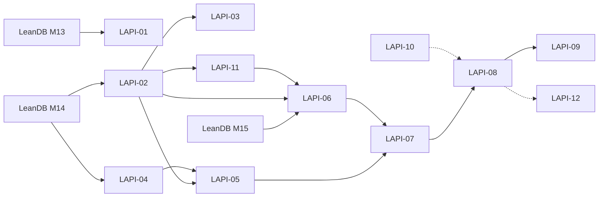

# LeanAPI tickets

Tickets for LeanAPI work, each standing alone: the problem with file evidence, a proposal, acceptance criteria, tests, and compatibility notes. Same format as the LeanDB (`LDB-`), LeanApp (`LA-`) and LeanReact (`LR-`) tickets in `leangd/tickets`. LeanAPI's prefix is `LAPI-`.

Priority: **P0** blocks the next milestone · **P1** needed to finish it · **P2** valuable, not blocking.
Size: S ≤ 2 days · M ≤ 1 week · L > 1 week (rough, single engineer).

## One API over LeanDB (PLAN.md M13–M16)

These are the LeanAPI side of the LeanDB work in [docs/QUERIES.md](../docs/QUERIES.md). LeanDB's side (M13 fixes, M14 values, M15 laws) is tracked as `LDB-` tickets in the LeanDB repository. Each ticket below names the LeanDB work it waits for.

| ID | Title | Pri | Size | Depends on | Status |
| --- | --- | --- | --- | --- | --- |
| [LAPI-01](LAPI-01-adopt-fixed-leandb.md) | Adopt the fixed LeanDB (M13): pin, proof update, public read snapshot | P0 | S | LeanDB M13 release (LDB-17…24 and the review fixes) | in progress: done on `bdd0e4c` by commit; retag when released |
| [LAPI-02](LAPI-02-endpoint-effects-over-leandb-programs.md) | Endpoint effects over LeanDB programs: `Read s` and `Txn s ε` | P0 | L | LeanDB M14 | done on M14b `d33d067` (by commit) |
| [LAPI-03](LAPI-03-problem-defaults-for-database-failures.md) | `ToProblem` defaults for LeanDB's typed failures, safe for isolation | P1 | M | LeanDB M14, LAPI-02 | done on M14b `d33d067` |
| [LAPI-04](LAPI-04-private-games-schema-on-typed-symbols.md) | private-games schema on typed symbols: `unique`, `schema`, `Checked` from proofs | P0 | S | LeanDB M14 | done on M14b `d33d067` (by commit) |
| [LAPI-05](LAPI-05-games-api-on-leandb-programs.md) | `gamesApi` over LeanDB programs, answering byte for byte as today | P0 | L | LAPI-02, LAPI-04 | done on M14b (lives in `DbApi.lean` until LAPI-08; receipts looked up, not claimed first: see ticket) |
| [LAPI-06](LAPI-06-carry-over-theorem.md) | The carry-over theorem: the running service is `Api.step` | P0 | M | LeanDB M15, LAPI-02 | open |
| [LAPI-07](LAPI-07-private-games-theorems-on-dbstate.md) | Re-establish private-games' theorems on `DbState`, plus restricted logical reads | P1 | L | LAPI-05, LAPI-06, LeanDB M15 | open |
| [LAPI-08](LAPI-08-move-model-theorems-and-retire-the-model.md) | Move the remaining model theorems; retire `Model/`, the native service and the app differential test | P1 | L | LAPI-07 | open |
| [LAPI-09](LAPI-09-docs-after-the-move.md) | README, design docs, evidence and the blog post after the move | P2 | S | LAPI-08 | open |

## Follow-ups from the review of LAPI-02…05 ([2026-09-23](../docs/reviews/2026-09-23-review-lapi-02-05-m14.md))

| ID | Title | Pri | Size | Depends on | Status |
| --- | --- | --- | --- | --- | --- |
| [LAPI-10](LAPI-10-framework-computed-retry-fingerprints.md) | Retry fingerprints computed by the framework, not written by hand | P1 | M | none | open |
| [LAPI-11](LAPI-11-database-endpoints-read-like-the-rest.md) | Endpoints over LeanDB read like the rest: one `api!`, no `fun _ =>`, no name clash | P2 | M | LAPI-02 | open |
| [LAPI-12](LAPI-12-private-games-no-runtime-checks-a-type-can-carry.md) | private-games: no runtime checks where a type can carry the fact | P2 | S | LeanDB: reads return invariant evidence (part 2); easier after LAPI-08 | open |

**Pin (2026-09-23):** LeanDB M14c `afe4544`. LAPI-02…05 build and pass on it; the only change needed was `WithReferrers` taking `ReferencedBy.Restricting` (M14c's restrict/cascade split).

**Finding (2026-09-23):** at LeanDB `64c768e`, M14b `d33d067` and still at M14c `afe4544`, `DbState` has no logical content (`DbState.get` is `implemented_by` with an empty-table body), so every theorem over `DbState` is trivially true. The compiled `get`/`set` disagree with those bodies, so `native_decide` can prove `False` about a `DbState` (a three-line proof; the axiom audit rejects it because it lists the native axiom). See LAPI-02's status. LeanDB M15 must fix this before LAPI-06/07.

LAPI-01 can start as soon as LeanDB tags its M13 release. LAPI-02 and LAPI-04 can start against LeanDB's M14 branch before it is released, pinned by commit.
